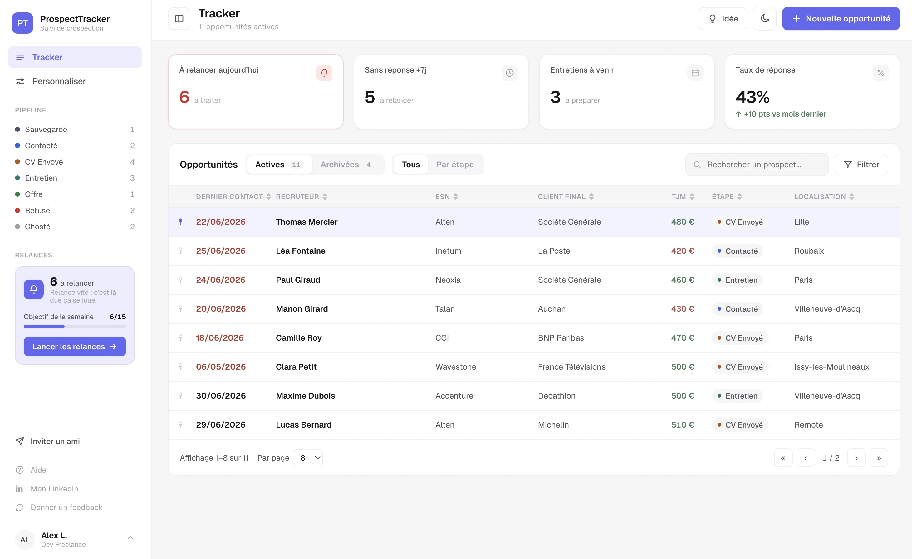

# ProspectTracker

**The prospecting tracker built for the freelance mission cycle** — smart follow-ups
and a view that drives action ("who do I follow up with today?") rather than
contemplation.

Freelancers, work-study students and job seekers track their prospecting by hand
(Notion, Excel, gut feeling): no automatic follow-ups, no scoring, no reason to open the
tool in the morning. ProspectTracker is the daily action-oriented work tool that fixes
that.



## Features

- **Tracker** — table view (TanStack Table) with sortable columns, global search,
  pagination, colored stage badges and day-rate coloring against a configurable
  reference rate.
- **Configurable pipeline** — rename / recolor / reorder / archive your own stages, job
  types and experience levels per account (no fixed enums).
- **Action KPIs** — to follow up today, active opportunities, ongoing interviews,
  response rate.
- **Automatic follow-ups** — email reminders based on last-contact date (Vercel cron +
  Resend), with a per-stage delay.
- **Auth & guest mode** — email + Google sign-in (Supabase), and a no-account trial that
  migrates local entries to the DB on sign-up.

## Stack

TanStack Start (Router + SSR, Nitro) · TanStack Query · TanStack Table · TypeScript
(strict) · Tailwind CSS v4 · shadcn/Radix UI · Supabase (Postgres + Auth) · Drizzle ORM ·
Resend · Stripe · PostHog · deployed on Vercel.

The app and the landing page live in the **same TanStack Start app**: public routes for
the LP, protected routes for the dashboard. One repo, one deployment.

## Getting started

**Prerequisites:** Node 24 (`.nvmrc`), pnpm 10.

```bash
pnpm install
cp .env.example .env   # then fill in the values below
pnpm dev               # http://localhost:3000
```

### Environment

| Variable                 | Description                                              |
| ------------------------ | -------------------------------------------------------- |
| `DATABASE_URL`           | Supabase Postgres connection string (transaction pooler) |
| `VITE_SUPABASE_URL`      | Supabase project URL (public)                            |
| `VITE_SUPABASE_ANON_KEY` | Supabase anon key (public, RLS-gated)                    |

### Database

```bash
pnpm db:generate   # generate a migration from the Drizzle schema
pnpm db:migrate    # apply migrations
pnpm db:studio     # browse the DB
```

## Scripts

```bash
pnpm dev            # dev server (SSR)
pnpm build          # production build
pnpm typecheck      # tsc --noEmit
pnpm lint           # ESLint
pnpm format         # Prettier --write
pnpm test           # Vitest
```

## Documentation

- Product requirements: [`docs/PRD.md`](docs/PRD.md)
- Data model: [`docs/reference/data-model.md`](docs/reference/data-model.md)
- Auth & SSR: [`docs/reference/auth.md`](docs/reference/auth.md)
- Data access security: [`docs/reference/data-access-security.md`](docs/reference/data-access-security.md)
- Guest mode: [`docs/reference/guest-mode.md`](docs/reference/guest-mode.md)
- Internationalization (fr/en): [`docs/reference/i18n.md`](docs/reference/i18n.md)
- Architecture decisions: [`docs/decisions/`](docs/decisions/)
- Contributor guide & conventions: [`CLAUDE.md`](CLAUDE.md)
